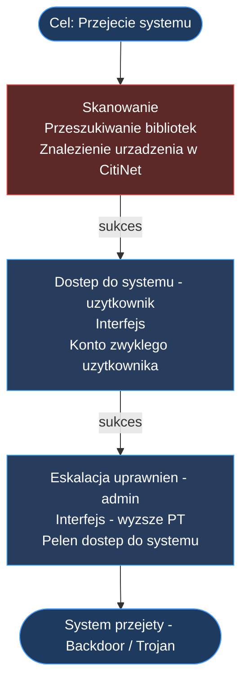

Generalnie podłączenie się do terminalu, komputera lub laptopa jest stosunkowo proste. Szczególnie jeśli masz bezpośrednie połączenie. Jeśli nie masz hasła to musisz zdobyć konto użytkownika. Jakiegokolwiek (**Interfejs**). A potem wykorzystać sam dostęp z poziomu tego użytkownika do tego aby zdobyć dostęp do konta administratora (**Interfejs**) - i tyle, system jest Twój.

Sprawa utrudnia się kiedy musisz zaatakować system zdalnie - bez bezpośredniego dostępu. Musisz najpierw odnaleźć ten system (**Przeszukiwanie bibliotek**), potem znaleźć wektor ataku (**Interfejs**) lub wykorzystać socjotechnikę aby zdobyć dostęp. Wyślesz do użytkownika maila z reklamą nowego **Pana Drąga** lub gorącymi mamuśkami w jego okolicy i bam - właśnie sam Ci dał dostęp.

Do czego to się sprowadza mechanicznie?

### Dostęp bezpośredni
Dostęp bezpośredni jest wtedy kiedy jesteś praktycznie przy tym urządzeniu i możesz się do niego podłączyć fizycznie. Żeby dostać się do takiego systemu potrzebujesz tylko 2 rzutów:

1. Dostęp do systemu - użytkownika - rzut na **Interfejs**. 
   Jeśli masz dostęp do konta użytkownika - masz też dostęp do wszystkich systemów którymi może zarządzać - kamer, wieżyczek, plików czy poczty. Ale nie do wszystkiego ma dostęp zwykły użytkownik.
2. Eskalacja uprawnień - administrator - rzut na **Interfejs** z wyższym PT.
   Udana eskalacja uprawnień daje pełen dostęp do systemu. Możesz sprawdzić wszystko, wyłączyć wszystko, łącznie z demonami i Czarnym LOD'em bez wchodzenia z nimi w walkę. Oczywiście one mogą Ci utrudniać uzyskanie tego dostępu. Dodatkowo możesz zostawić sobie **Backdoor**, żeby móc omijać zabezpieczenia w przyszłości lub **Trojana** aby móc kontrolować system zdalnie w przyszłości.

### Dostęp zdalny
Jeśli nie masz fizycznego dostępu do punktu sieciowego, ani nie jesteś w stanie go wykryć **Skanerem**, zawsze możesz poszukać w CitiNet'cie czy jest ono podłączone do sieci miejskiej. Jeśli znajdziesz takie urządzenie, musisz jeszcze rzucić na **Wektor ataku**. Sprowadza się to do dodatkowych 2 rzutów zanim dostaniesz dostęp do systemu:
1. Sprawdzenie czy urządzenie jest w sieci i pod jakim adresem sieciowym - rzut na **Przeszukiwanie bibliotek**

### Zdolności interfejsu

#### Skaner/Ping (Niewykrywalne)
Wyszukuje okoliczne punkty dostępu podłączone do sieci. 
Pokazuje również okoliczne Neuroporty.

#### Backdoor (Niewykrywalne)
W ramach Akcji w Sieci, pozwala na koncie użytkownika lub administratora zostawić sobie furtkę dostępu do systemu - tylko dla dostępu bezpośredniego i tylko do poziomu dostępu na którym jest.

#### Maskowanie (Wykrywalne)
**Bez zmian**
W ramach Akcji Sieciowej pozwala ukryć ślady twojej obecności w danej Architekturze, a także wszelkie zostawione tam Wirusy. Jeśli inny Netrunner będzie chciał za pomocą zdolności **Zwiad** odkryć efekty twoich Akcji, PT dla tego Zwiadu będzie równe wartości uzyskanej w Teście Maskowania. Jeśli przed odłączeniem się nie wykorzystasz Maskowania, inni Netrunnerzy po skorzystaniu ze Zwiadu automatycznie odkryją, co 
zrobiłeś w danej Architekturze.

#### Kontrola (Wykrywalne)
**Drobne zmiany**
Pozwala Netrunnerowi kontrolować za pomocą węzła kontrolnego rzeczy podłączone do danej Architektury Sieciowej, na przykład kamery, drony, wieżyczki, siatki laserowe, windy, spryskiwacze itp. 
**Kontrolowanie urządzeń podłączonych do sieci nie wymaga dodatkowego rzutu, chyba że, ktoś inny o tą kontrolę walczy.**

#### Ajdi (Niewykrywalne)
Pozwala określić rodzaj pliku, jego nazwę i typ.
Określenie typu pliku nie wymaga rzutu, przeczytanie pliku nie wymaga rzutu.
**Przeczytanie zawartości pliku wymaga Akcji Sieciowej.**

#### Zwiad (Wykrywalne)
Zwiad pozwala określić co znajduje się w systemie, niestety, potrafi zaalarmować też aktywne systemy obronne lub innych netrunnerów. Nie mniej **jest to niezbędny krok, żeby dowiedzieć co znajduje się na systemie.**
**Zwiad wymaga rzutu, ale zawsze się udaje. Rzut jest po to aby określić jak bardzo rzucasz się w oczy w sieci**

#### Ślizg (Niewykrywalne)
W ramach Akcji Sieciowej pozwala na próbę ucieczki z walki z jednym Programem 
typu Czarny LOD i na **Eskalację uprawnień** jeśli Ci się powiedzie, lub wypięcie się z sieci.

#### Wirus (Wykrywalne)
Wirus to bardzo destrukcyjny program wpływający na architekturę systemu i może wprowadzić trwałe szkody do systemu. Możesz podłożyć komuś wirusa, który zostanie aktywowany na określoną akcję sieciową (jak otwarcie pliku).

#### **Trojan** (Wykrywalne)
Specjalny typ wirusa, który pozwala na zdalną kontrolę systemu. **Rzut na Interfejs określa jak łatwo go wykryć**. Trojana można zainstalować tylko na poziomie administratora. Pozwala wrócić do systemu nawet bez bezpośredniego kontaktu i wprowadzać na nim zmiany długo po tym jak się uzyskało do systemu dostęp. A przynajmniej dopóki zdolny netrunner nie wykryje go w systemie.

#### Paf (Wykrywalny)
W ramach Akcji Sieciowej pozwala wykonać atak wymierzony w Program lub wrogiego Netrunnera. Jeśli wynik Testu ataku Pafem będzie większy od Interfejsu + 1k10 Programu lub Interfejsu + 1k10 Netrunnera, zadajesz `Interfejs x k6` obrażeń Programowi lub mózgowi Netrunnera. 

## Co dalej?

Reszta zasad bez zmian. Walka w sieci dalej działa tak samo i zajmuje tyle samo akcji sieciowych. Programy i Czarny LOD działa nadal tak samo.

## Quick Hacki

Quick hacki zostają uproszczone i funkcjonują jak Walka bronią białą. 

Żeby wykonać udany Quick Hack, należy wykonać rzut przeciw rzutowi Koncentracji przeciwnika. Jeśli rzut spełnia wymagania i przewyższa minimum o 1 Koncentrację przeciwnika - Quick Hack się powiódł.

#### Self ICE

Self ICE teraz nie podnosi poziomu trudności pierwszej bariery wejścia, a podnosi poziom **Koncentracji** o 2 w przypadku obrony przed atakiem.

## Walka w sieci

Programy mogą być tylko zainstalowane lub skasowane. 
Są tylko 4 typy programów:
- Demony - kontrolujące węzły kontrolne
- Wirusy - zaszyte w systemie pułapki aktywowane jakąś akcją
- LOD'y - zabezpieczenia ograniczające dostęp, które trzeba przełamać. 
- CzarneLOD'y - zabezpieczenia agresywne, które reagują na pojawienie się intruza w infrastrukturze

### Demony

Demony są niegroźne dla sieciowca. Atakują tylko i kontrolują fizyczne urządzenia, ale w sieci są bezbronne. Udany rzut przeciwko PT ich stopnia zaawansowania wystarczy, żeby je deaktywować.

**Typowe demony:**
- Demon kontrolujący kamery - dezaktywacja PT 6
- Demon kontrolujący wieżyczki - dezaktywacja PT 8 

Poziom trudności dezaktywacji określa poziom skomplikowania demona.

### Wirusy

Wirusy to pułapki zastawione w sieci, które mogą być aktywowane przez otwarcie pliku, sprawdzenie węzła kontrolnego.
- Uniknięcie efektu wirusa - Koncentracja PT 13
- Odkrycie wirusa - Kryptografia PT 13

### LOD

Zwykły LOD może blokować dostępu do przestrzeni administratora, lub określonych plików. 
LOD ma jedynie PW, nic więcej. Atak na LOD to Interfejs x k6 obrażeń.

| Poziom | Łatwy | Średni | Trudny | Wyjątkowy |
| ------ | ----- | ------ | ------ | --------- |
| PW     | 20    | 30     | 40     | 60        |

### Czarny LOD

Czarny LOD jest zabezpieczeniem agresywnym i o ile ma mniej PW niż zwykły LOD, 
to jednak potrafi bardziej poturbować w realu. Każdy Czarny LOD ma:
- **PW** - punkty wytrzymałości 
- Interfejs - ich własna wartość Interfejsu do rzutów przeciwstawnych
- Obr - wartość obrażeń które zadaje w przypadku powodzenia

| Czarny LOD | PW  | Interfejs | Obr |
| ---------- | --- | --------- | --- |
| Łatwy      | 6   | 2         | 2k6 |
| Średni     | 10  | 3         | 3k6 |
| Trudny     | 20  | 4         | 4k6 |
| Śmiertelny | 30  | 6         | 6k6 |
Czarny LOD od razu wie, że jesteś w sieci lokalnej, kiedy wykonujesz Wykrywalne akcje.
Na szczęście w sieci lokalnej nigdy nie ma więcej niż 1 Czarny LOD.

**Co zrobić kiedy napotkasz Czarny LOD?**
To jest ułamek sekundy na decyzję i masz tylko 3 decyzje:
- Zrobić **Ślizg** i uciec - Twój Interfejs + k10 vs Interfejs LOD'a + k10
- Zrobić **Ślizg** i ponownie zaatakować.
- Zrobić **Ślizg** i zdobyć konto administratora - Pierwszy rzut na Ślizg, drugi na Eskalację uprawnień.
- Zaatakować i zniszczyć - Twój Interfejs + k10 vs Interfejs LOD'a + k10. 
	- Sukces oznacza, że rzucasz tyle k6 ile masz poziomu Interfejsu i jeśli uda Ci się za jednym rzutem zniszczyć LOD, wtedy zostaje skasowany.
	- Jeśli nie uda Ci się skasować LOD'a, zostajesz wyrzucony z sieci, ale nie otrzymujesz obrażeń.
	- Jeśli LOD wygra rzut przeciwstawny, otrzymujesz obrażenia do mózgu i zostajesz wyrzucony z sieci.

#### Upraszczając

**Interfejs:** To Twoja siła bojowa. To jest punkt wyjścia do tego czy trafisz lub czy uda Ci się unik.
**Ślizg:** To akcja uniku. Po jej wykonaniu jesteś bezpieczny przez 1 rundę.
**Paf:** To Twój atak. Zawsze masz tyle kości obrażeń K6 ile wynosi Twój **Interfejs**. 
Masz Interfejs na poziomie 4 - zadajesz 4k6 obrażeń.
